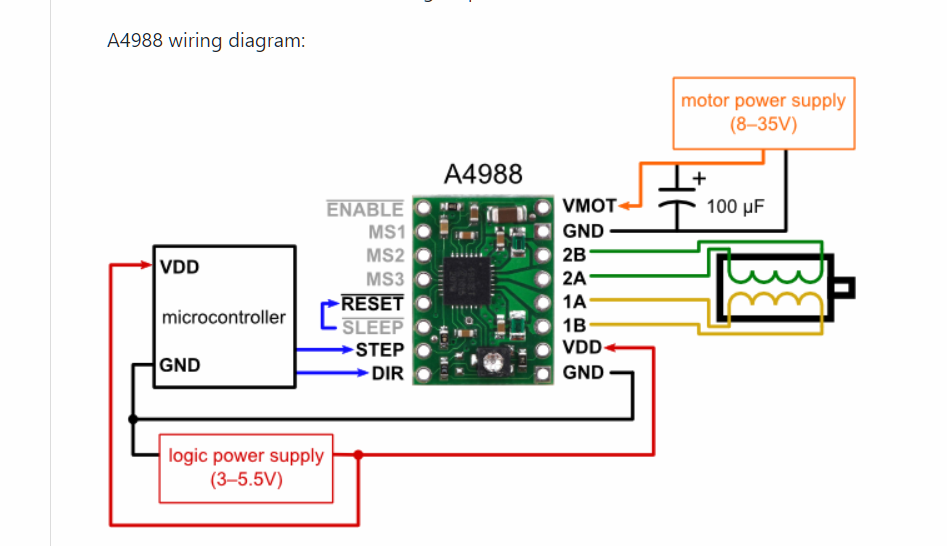

# Self-calibrating-surgical-bed

Surgical bed that can track a point on the subject placed on the operating table and move accordingly.

## Motors and Motor Controllers

The basic mechanics for the XY motors came from a kit
(http://learn.makeblock.com/en/xy-plotter-robot-kit/)  We used The mechanics from
here meaning the two motors and the one motor driver.  The control was supplied by
the rasberry Pi.  

The motors used were Nema 17 bipolar stepper motors with four leads.  They were very
powerful and when they were held in position could draw 1.7 Amps and were very hard
to move. These four wires controlled two sets of coils, both phase A and phase B.

The controllers for the motors both used the stepper motor driver A4988 (included
here) 

The schematic that we used was the A4988 driver module (A4988 Stepper Motor Driver
Module, Red PCB with Heat Sink for CNC 3D Printer RepRap StepSticknd) and was wired as follows:

Starting from the top right and working down we see the following pins:

* VMOT – The motor DC supply voltage (positive). The maximum voltage is 35 volts.
* GND  (Motor) – The motor supply voltage ground.  This was connected straight to the negative
	voltage supply.
* 2B, 2A – The connections to coil 2 of the bipolar stepper motor.
* 1A, 1B – The connections to coil 1 of the bipolar stepper motor.
* VDD – The logic supply DC voltage. This was connected to a separate power supply that
	supplied 5V to the drivers reference circuit.
* GND – The logic supply ground. 

Now looking down the other side of the A4988 module:

* ENABLE Bar – This is an active low connection, when brought low (ground) the A4988
	module is enabled. To get the motors to work, this needs to be held low.
	Turning this high leads to a rapid shut off and should be used for safety.
* MS1, MS2, MS3 – These three connections determine the microstepping mode of the A4988 module. By setting the logic levels here you can set the motor to Full, Half, Quarter, Eighth, Sixteenth steps.
	We set these to Quarter by setting them to (low, high, low).  
* RESET Bar – This is an active low line that will reset the module. This must be
	 pulled high. 
* SLEEP Bar – If this line is set low the module will enter a low-powered sleep mode
		and consume minimal current. This was set to High.
* STEP – This is how you drive the motor from an external microcontroller or square wave oscillator. 
	Each pulse sent here steps the motor by whatever number of steps or microsteps that has been set 
	by MS1, MS2 and MS3 settings. The faster you pulse this the faster the motor
	will travel. Set to a GPIO pin on the rasberry pi.
* DIR – The direction control A high input here drives the motor clockwise, a low
 	will drive it counterclockwise. Again set by the GPIO pins on the rasberry Pi

In order to get the motors to turn reliably one had to be careful about the grounds
and avoid ground loops.  What worked was to connect VMOT and GND (motor) to one
supply.  Each motor drew some 0.5 A, so we found that using a supply that can source
more than one amp at 8 V was critical. VMOT and GND (Motor) were connected directly
to the +/- leads of the supply, without connecting to GND of the supply. A separate 5V supply powered the logic and the
drivers and was connected across VDD and GND (+/- leads, again not connecting GND of
the supply). The rasberry pi also has a
ground and that ground was connected straight to the digital GND here. That meant that Pi pulses
were interpreted correctly.  Since the Pi has a connection to universal GND, and since the
driver connects the power gnd to Gnd through a resistor,  neither supply was
directly grounded.  In fact doing so created a ground loop and the current did not
all go where it should, causing the motors to be unreliable.

Another important point was to tie SLEEP Bar, RESET Bar High and ENABLE BAR low.  If
this was not done the motors also did not work. We found leaving them floating
produced unreliable turning.

For the other motor, we used the MakeBlock driver which was also based on the A4988.
In that board MS1, MS2, MS3 were set with toggles and that board had SLEEP, RESET,
and ENABLE, not the active low versions.  Those lines then were set as (LOW, LOW, and
HIGH) and needed to be set in order to drive the motors (not floated).

Full steps work but quarter steps (with some 0.0005 sec/step) produced really smooth
motor trajectories.
